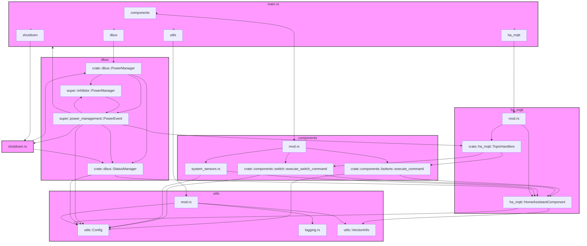

```mermaid
graph TD
    subgraph main_rs ["main.rs"]
        main_rs_components["components"]
        main_rs_dbus["dbus"]
        main_rs_ha_mqtt["ha_mqtt"]
        main_rs_shutdown["shutdown"]
        main_rs_utils["utils"]
    end

    subgraph components ["components"]
        direction LR
        components_mod_rs["mod.rs"]
        components_buttons_rs["buttons.rs"]
        components_switch_rs["switch.rs"]
        components_system_sensors_rs["system_sensors.rs"]
    end

    subgraph dbus ["dbus"]
        direction LR
        dbus_mod_rs["mod.rs"]
        dbus_inhibitor_rs["inhibitor.rs"]
        dbus_power_management_rs["power_management.rs"]
        dbus_status_rs["status.rs"]
    end

    subgraph ha_mqtt ["ha_mqtt"]
        direction LR
        ha_mqtt_mod_rs["mod.rs"]
        ha_mqtt_discovery_rs["discovery.rs"]
        ha_mqtt_handlers_rs["handlers.rs"]
    end

    subgraph utils ["utils"]
        direction LR
        utils_mod_rs["mod.rs"]
        utils_config_rs["config.rs"]
        utils_logging_rs["logging.rs"]
        utils_version_rs["version.rs"]
    end

    %% Top-level file
    main_rs --> main_rs_components
    main_rs --> main_rs_dbus
    main_rs --> main_rs_ha_mqtt
    main_rs --> main_rs_shutdown
    main_rs --> main_rs_utils

    %% components module
    main_rs_components --> components_mod_rs
    components_mod_rs --> components_buttons_rs
    components_mod_rs --> components_switch_rs
    components_mod_rs --> components_system_sensors_rs

    components_buttons_rs --> ha_mqtt_discovery_rs["ha_mqtt::HomeAssistantComponent"]
    components_buttons_rs --> utils_config_rs["utils::Config"]

    components_switch_rs --> ha_mqtt_discovery_rs["ha_mqtt::HomeAssistantComponent"]
    components_switch_rs --> utils_config_rs["utils::Config"]

    components_system_sensors_rs --> ha_mqtt_discovery_rs["ha_mqtt::HomeAssistantComponent"]
    components_system_sensors_rs --> utils_config_rs["utils::Config"]


    %% dbus module
    main_rs_dbus --> dbus_mod_rs
    dbus_mod_rs --> dbus_inhibitor_rs
    dbus_mod_rs --> dbus_power_management_rs
    dbus_mod_rs --> dbus_status_rs

    dbus_inhibitor_rs --> dbus_power_management_rs["super::power_management::PowerEvent"]

    dbus_power_management_rs --> dbus_inhibitor_rs["super::inhibitor::PowerManager"]
    dbus_power_management_rs --> dbus_status_rs["crate::dbus::status::StatusManager"]
    dbus_power_management_rs --> ha_mqtt_handlers_rs["crate::ha_mqtt::TopicHandlers"]
    dbus_power_management_rs --> shutdown_rs["crate::shutdown"]
    dbus_power_management_rs --> utils_config_rs["crate::Config"]
    dbus_power_management_rs --> main_rs["crate::initialize_mqtt_connection"]


    dbus_status_rs --> ha_mqtt_discovery_rs["ha_mqtt::HomeAssistantComponent"]
    dbus_status_rs --> utils_config_rs["utils::Config"]

    %% ha_mqtt module
    main_rs_ha_mqtt --> ha_mqtt_mod_rs
    ha_mqtt_mod_rs --> ha_mqtt_discovery_rs
    ha_mqtt_mod_rs --> ha_mqtt_handlers_rs

    ha_mqtt_discovery_rs --> utils_config_rs["utils::Config"]
    ha_mqtt_discovery_rs --> utils_version_rs["utils::VersionInfo"]

    ha_mqtt_handlers_rs --> components_buttons_rs["crate::components::buttons::execute_command"]
    ha_mqtt_handlers_rs --> components_switch_rs["crate::components::switch::execute_switch_command"]


    %% shutdown.rs
    main_rs_shutdown --> shutdown_rs["shutdown.rs"]
    shutdown_rs --> dbus_mod_rs["crate::dbus::PowerManager"]
    shutdown_rs --> dbus_status_rs["crate::dbus::StatusManager"]


    %% utils module
    main_rs_utils --> utils_mod_rs
    utils_mod_rs --> utils_config_rs
    utils_mod_rs --> utils_logging_rs
    utils_mod_rs --> utils_version_rs


    %% Styling
    classDef module fill:#f9f,stroke:#333,stroke-width:2px;
    class main_rs,components,dbus,ha_mqtt,utils,shutdown_rs module;
```
